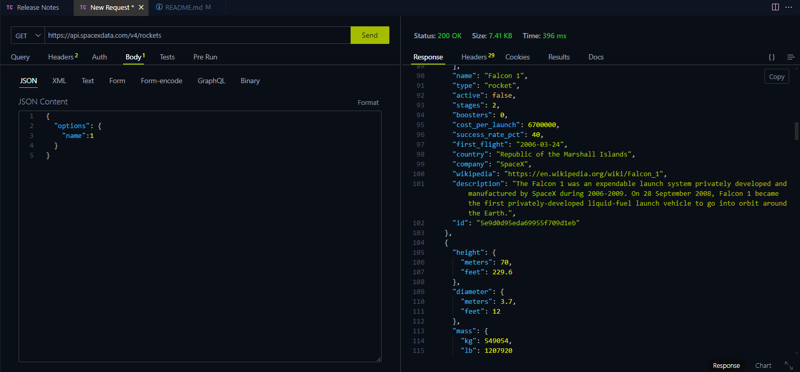

# SpaceX Project

## Descripción del Proyecto

Este proyecto se inicia con la configuración básica necesaria, definiendo la estructura de carpetas y archivos a utilizar. El proyecto se desarrollará de manera modular siguiendo las especificaciones dadas.

## Estructura de Carpetas

- **JavaScript**: Carpeta para los archivos JavaScript.
- **Views**: Carpeta para las diferentes vistas de la página. Aquí se almacenarán todos los archivos HTML, además del `index.html`.
- **CSS**: Carpeta para los archivos CSS, incluyendo `variables.css` que se utilizarán en los distintos archivos HTML.
- **Storage**: Carpeta para fuentes e imágenes, organizada en dos subcarpetas: una para fuentes y otra para imágenes que se usarán a lo largo del proyecto.

## Documentación

Para comenzar con el proyecto, primero se leyó la documentación del API de SpaceX. Se investigó el método `query` para hacer peticiones a los distintos endpoints que ofrece el API.

Testeo del endpoint All rockets:

